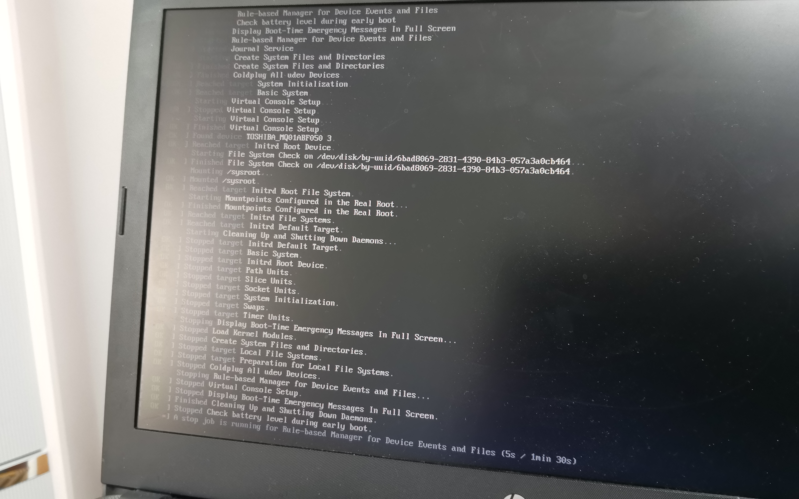

> It started when a classmate gave me a laptop from 2017 with terrifying specs to 'optimize'.
> It took 5 minutes just to boot up... so I decided to install Arch. I'm sure they'll be very grateful.

#### Specs


Looks ridiculous, right? 4GB RAM is one thing, but that CPU at 1500Mhz...

Anyway, a job is a job. But how do you install Arch on a machine that takes 5 minutes to boot?

## The Unconventional Way

First, we need an already installed Arch system. I used the drive from my main workstation.
P.S. Make sure `fstab` uses UUIDs!

You probably guessed it: `rsync` to the rescue!

-   **Partitioning**

```bash
cfdisk /dev/sda
# 512M for boot, 4G for swap, rest for root.
mount /dev/sda3 /mnt/
mount /dev/sda1 /mnt/boot/
swapon /dev/sda2
```

-   **Syncing**

```bash
rsync -avx --exclude=/dev/* --exclude=/proc/* \
--exclude=/sys/* --exclude=/tmp/* \
--exclude=/run/* --exclude=/mnt/* \
--exclude=/home/Projects/* \
--exclude=/home/Games/* \
--exclude=/lost+found / /mnt/
```

-   **Configuration**

```bash
genfstab -U /mnt > /mnt/etc/fstab
arch-chroot /mnt
grub-install --target=x86_64-efi --efi-directory=/boot --removable
grub-mkconfig -o /boot/grub/grub.cfg
```

## It's an Art Form!



### Bug Fixes

1.  **Sound Driver**: The driver was there, but the default output was set to HDMI. Fixed by editing `/etc/asound.conf`.
2.  **Performance**: Installed AMD GPU drivers and CPU microcode. It's still slow, but that's just the hardware.

# Summary

The vintage laptop is now running Arch. It's not exactly 'smooth', but the experience was worth it. Tinkering is fun!
