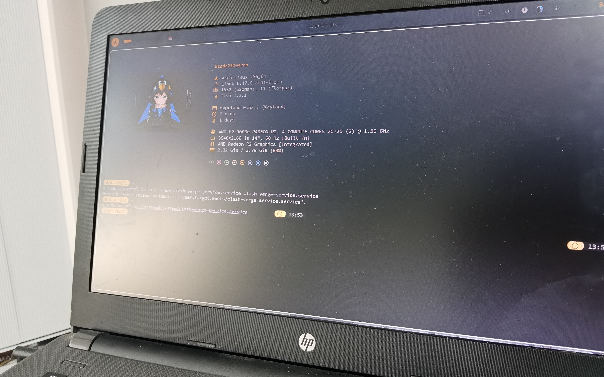

> 起因是我同学给我了一台配置十分可怕的来自传说中的2017年的笔记本电脑让我优化
> 然后我花了5分钟开机。。。于是我决定给它安装Arch。相信同学一定会很感谢我的。

#### 配置展示


看上去很离谱是吧？~~其实我也觉得很离谱~~
4G RAM没什么好说的。CPU??? 1500Mhz???
#### **请输入文本**

好吧。既然已经接了活，当然得做完了
可是这种配置的笔记本电脑，开机都能卡5分钟，怎么装arch...

## 当然是不正经方式了

首先我们需要一个已经安装好的Arch，我这里是我自己的主机上的硬盘
P.S.FSTAB需要使用UUID!不然挂载可能失败。

相信大家都已经猜到我要做什么了
rsync，启动！

- 分区！

```
cfdisk /dev/sda
第一个boot，512M，第二个swap，4G，第三个root。
mount /dev/sda3 /mnt/
mount /dev/sda1 /mnt/boot/
swapon /dev/sda2
```

- 同步！

```
rsync -avx --exclude=/dev/* --exclude=/proc/* 
--exclude=/sys/* --exclude=/tmp/* 
--exclude=/run/* --exclude=/mnt/* 
--exclude=/home/Projects/* 
--exclude=/home/Games/* 
--exclude=/lost+found / /mnt/
```

排除掉Games才不是有Galgame，是因为里面有一个90G的原神...

- 配置！

其他不变，重点弄和磁盘相关的
```
genfstab -U /mnt > /mnt/etc/fstab
nano /etc/fstab
（删掉挂载的另一个swap，如果有）
arch-chroot /mnt
grub-install --target=x86_64-efi --efi-directory=/boot --removable
（我的/boot不标准，应该挂载在/boot/EFI，但是不标准没什么影响）
（这就是我给boot分512M的原因，因为里面有内核）
grub-mkconfig -o /boot/grub/grub.cfg
```

## 至此，已成艺术！(


### 修复BUG

### 1 声卡驱动
驱动当然是有的，我被坑了半天，最后发现播放不了声音是因为默认输出是hdmi
想要解决也很简单

```
cat /etc/asound.conf
defaults.pcm.card 1
defaults.pcm.device 0
defaults.ctl.card 1
```

设置默认声卡即可。

### 2 异常卡顿
安装AMD显卡驱动和CPU微码就好了
(好不了一点，硬件不行)

```
pacman -S mesa lib32-mesa xf86-video-amdgpu xf86-video-ati vulkan-radeon
```

# 总结



好的，现在这台古董笔记本也是装上了Arch，但是没有流畅到哪里去。最直观的原因就是这玩意配置太低。。。总之，折腾还是很快乐的！欢迎关注我的Bilibili观看我的最新视频！
